# 复习笔记

## 人机交互概述

什么是人机交互：Human-Computer Interaction，是一门涉及人类使用的交互式计算系统的设计、评估和实施以及围绕它们的主要现象的研究的学科

什么是用户体验：用户体验包含用户和计算机交互的各个方面

不能够设计用户体验、只能为用户体验而设计

UCD：User-Centered-Design 以用户为中心的设计方法

界定什么是人机交互的研究内容

人机交互为什么重要：以美国核泄漏事件为例，差的人机交互会导致人在与系统交互的过程中产生错误或非预期的行为、甚至导致毁灭性的灾难

- 市场角度：用户期望简单易用的系统、对设计低劣的系统容忍度越来越差
- 企业角度：提高员工的生产效率、降低产品的开发成本、降低产品的后续支持成本
- 用户角度：获得较高的主观满意度、减少时间、金钱、生命损失

评价“人机交互就是人机界面设计”：不完全的，人机交互的一部分是人机界面交互，还会涉及到心理学等多个其他学科

## HCI 的历史

在人机交互发展中：新的并没有完全取代旧的

- 新的界面变革会包含上一代界面：作为一种特例
- 旧的交互方式仍有其存在的必要性：以前的用户从未消失
- 学习目的：利用原有技术实现新的交互手段

四个阶段

1. 批处理阶段

- 每次只能由一个用户操作计算机
- 使用 0|1 编写程序

这一阶段对计算机的操作不符合人的习惯、耗费时间，容易出错、且只有少数专业人士才能够运用自如

2. 联机终端时代

- 1950S，命令行界面出现：一维界面，回车后不能再对命令内容进行修改
- 如何为各种命令制定恰当的名称：大部分命令语言对用户输入的要求非常严格，命令名称的缩写在一定程度上减轻了用户的使用负担

3. 图形用户界面 GUI 时期

- 1963 年发明的 SketchPad：第一个交互式绘图系统

- 1964 年发明的鼠标
- WIMP 界面（window icon menu pointing）：用户可在窗口内选取任意交互位置、且不同窗口之间能够叠加，是二维的半界面
- GUI 的主要特征是：**直接操纵**
- 图形界面就会优于字符界面吗：不同的交互方式本身在可用性方面并没有根本性的不同，更重要的是认真对待界面设计的态度。不同的交互方式是为不同的使用场景设计的，比如服务器运维人士，使用终端的字符界面更加快速高效，但比如从事图形剪辑等工作的用户来说，肯定需要图形界面的操控，更加直观

4. 多媒体界面

- 引入动画、音视频等动态媒体
- 从二维半界面向三维甚至更高发展
- 交互将高度便携和个性化

## 交互设计的原则与目标

什么是交互框架，为什么要有交互框架

- 提供理解或定义某种事物的一种结构
- 能够帮助人们结构化设计过程
- 认识设计过程中的主要问题
- 还有助于定义问题所涉及的领域

执行/评估活动周期 EEC

- 最有影响力的交互框架
- 定义了活动的**四个组成部分**：目标、执行、客观因素和评估

目标不等于意图：单个目标可对应多个意图

- 如删除文档中的部分内容的目标，可以对应意图 1，通过编辑菜单删除；意图 2，通过删除按钮删除
- 每个意图包含一系列的活动

EEC 模型：从用户视角探讨人机界面问题
共有七个阶段

- 1-4：执行阶段：左半部分
- 5-7：评估阶段：右半部分
- 每个循环代表一个动作

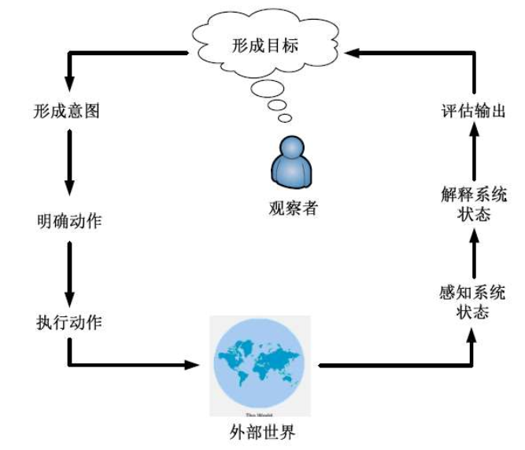

我们可以使用 EEC 模型来解释为什么有些界面使用存在问题

- 执行隔阂：用户想要执行的动作和系统允许的动作有差异，比如想要提交找不到提交按钮
- 评估隔阂：评估阶段中可能出现的一个问题是用户执行一个操作后总是想感知一下自己的操作的情况（是否结束、是否需要修改），但是系统没有给反馈

扩展的 EEC 模型：EEC 模型不能描述人与系统通过界面进行的通信
四个构成部分 + 四个步骤

- 系统：内核语言
- 用户：任务语言
- 输入：输入语言
- 输出：输出语言

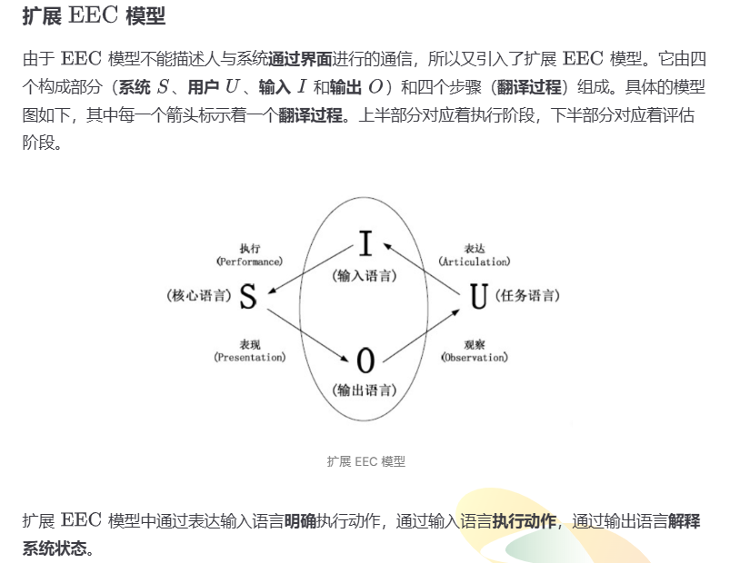

执行阶段：定义、执行、表现
设计人员因保证从输入到系统的翻译是容易的

评估阶段：观察

软件产品的用户群体已发生巨大转变：从以往热爱技术的专业人员，转变为现在缺乏耐心的消费者
观点也在发生转变：从侧重内部效率和可靠性的传统软件指令观，转变为用户视角的人机交互软件质量观

什么是“用户友好”的软件

- 用户希望在完成任务的时候，机器不要碍手碍脚
- 不同用户的需求各异，不能从系统单方面友好

什么是“可用”的软件

- 关于产品满足具体的可用性标准，相对客观
- 是用户体验的基础

什么是“用户体验”：是相对主观的概念，使用户喜欢产品

五个可用性目标：通过对这五个目标的度量，为交互设计人员提供了一个评估交互式产品和用户体验各方面的具体方法

1. 易学性：使用系统的难易，关键在于确定用户准备花费多长时间学习一个产品
2. 易记性：学会使用并记住该产品如何使用的难易程度

    1. 影响因素：良好的组织，使用用户已有的经验帮助提高易记性

        - 意义：有意义的图片、命令名和菜单项
        - 位置：将特定对象放在某个特殊位置
        - 分组：对事物按照逻辑进行恰当的分组
        - 惯例：尽可能使用通用的对象或符号
        - 冗余：使用多个感知通道对信息进行编码
3. 安全性：避免用户发生危险和陷入不好的情形，为用户提供各种出错时的恢复方法
4. 效用性：一定程度上该产品提供了正确的功能，可以让用户做他们需要做的或想做的事情，如提供了强大计算工具的会计软件包
5. 高效率：产品在对用户执行任务的支持程度，当用户学会使用产品之后，用户应该具有更高的生产力水平，即效率

    - 这里的效率指**熟练**用户到达学习曲线上平坦阶段时的稳定绩效水平

用户体验和可用性的关系

- 用户体验偏主观而可用性偏客观
- 用户体验和可用性有时候存在矛盾的地方，比如有些游戏难度很高，违反可用性
- 有些可用性和用户体验目标无法兼容
- 认识和理解可用性和其他用户体验目标之间的关系是交互设计的核心

超越可用性

- Schaffer 认为，应该更多地关注用户体验而非可用性，如购物网站，希望说服用户购物
- 以说服为目的的设计关键主要是采用巧妙和令人愉快的方式令人信任和感到舒服

简易的可用性工程

- 特点：以提高产品的可用性为目标的开发方法论，借鉴了许多不同领域的方法和技术，强调**以人为中心**来进行交互式产品的设计研发

简易的可用性工程四种主要技术

1. 用户和任务观察：直接与潜在用户进行接触，不要满足于间接的接触和道听途说
2. 场景：简便易行的原型工具，通过省略整个系统的若干部分来减少实现的复杂性
3. 简化的边做边说
4. 启发式评估

边做边说法：让**真实用户**在使用系统时候，讲出他们的所思所想，是最有价值的单个可用性工程方法
具体执行的时候，实验人员需要不断地提示用户，或请他们事先观摩

启发式评估：让**专家用户**不去真正使用系统，根据启发式准则进行逐条检查
研究表明，启发式评估能够发现许多可用性问题，剩下的通过边做边说来发现
通常专家用户为 3-5 位

十条启发式原则

1. 系统状态的可见度：如下载进度条
2. 系统和现实世界的吻合：界面上的语言使用用户熟悉的词汇，遵循现实世界的惯例
3. 用户享有控制权合自主权：提供返回方法
4. 一致性和标准化：一致的颜色、布局、大小写等
5. 避免出错：如提供选择日期的表格
6. 依赖识别而非记忆：提高系统的易记性
7. 使用的灵活性和高效性：充分考虑不同类型用户的使用偏好
8. 帮助用户识别、诊断和恢复错误：提高系统的安全性
9. 帮助和文档
10. 审美感和最小化设计：小米遥控器，相比较传统遥控器，删去了数字部分，最小化设计

## 评估的基本知识

评估侧重系统的可用性和用户体验
邀请用户进行评估的目的**不是**设法理解用户，而是评估特定用户在一个特定的环境背景中如何使用一个系统来执行一个特定的任务

评估的四个 W

- Where：在哪里评估，取决于正在评估的对象
- When：何时开展评估，取决于产品的类型
  对于新产品，可以通过评估检查是否正确理解了用户的需求，被称为“形成性评估”，目的是调整和完善设计
  对于已完成产品成功与否的评估，被称作“总结性评估”，目的是确定产品需要改进的方面

- 这不是两个 W 吗？

评估原则

- 评估应该依赖于产品用户，与专业技术人员的水平和技术无关
- 评估与设计应结合进行，仅靠用户最后对产品的一两次评估，不能全面反映出软件可用性
- 评估应在用户的实际工作任务和操作环境下进行（Where）：根据用户完成任务的结果，进行客观的分析和评估
- 要选择有广泛代表性的用户：参加测试的人必须具有代表性

评估的几种范型

1. 快速评估：设计人员非正式地向用户了解反馈信息，以证实设计构思是否符合用户需要
2. 可用性测试：在评估人员的密切控制下实行，为了量化表示用户的执行情况，一般是典型用户执行典型任务时的情况
3. 实地研究：在自然工作环境中进行的，理解用户的实际工作情形以及技术对他们的影响
4. 预测性评估：研究人员通过想象或对界面的使用过程进行建模，由专家完成，根据专家对典型用户的了解，来预测可用性问题

常见评估方法的组合

- 启发式评估 + 边做边说
- 访谈 + 问卷调查

人机交互的实证研究方法

1. 研究假设，实验通常从研究假设开始

    1. 零假设：指不同的实验条件下不会产生差异，*下拉菜单和弹出菜单在定位页面的时间开销上没有差异*
    2. 备择假设：是一个与零假设相反的陈述，*下拉菜单和弹出菜单在定位页面的时间开销上存在差异*
    3. 我们的实验目标是找到统计学证据来反驳或否定零假设，以支持备择假设
    4. 一个成功的实验，从一个或多个好的假设开始是至关重要的
2. 因变量和自变量：一个定义明确的假设会明确说明研究的因变量和自变量

    1. 自变量是指研究者感兴趣的因素，该变量与受试者的行为无关
    2. 因变量是指研究者感兴趣的结果，该变量依赖于受试者的行为或自变量的变化，因变量必须被明确定义
    3. 研究者希望找出自变量的变化是否会引起因变量的变化，以及是如何引起的变化
    4. 研究必须是可复现的
3. 实验构成

    1. 实验条件：指的是我们需要比较的不同技术、设备或程序，即自变量取值
    2. 实验单位：指的是我们应用实验条件的对象，通常是具有**特定特征**的人类受试者
    3. 分配方式：指的是将实验单位分配到不同实验条件的方式，需要**完全随机化**

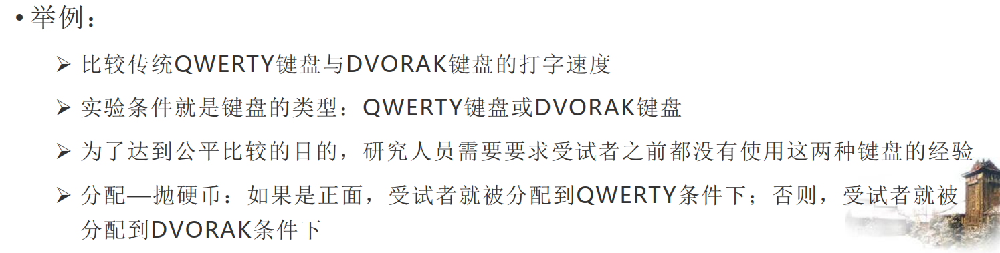

4. 实验设计

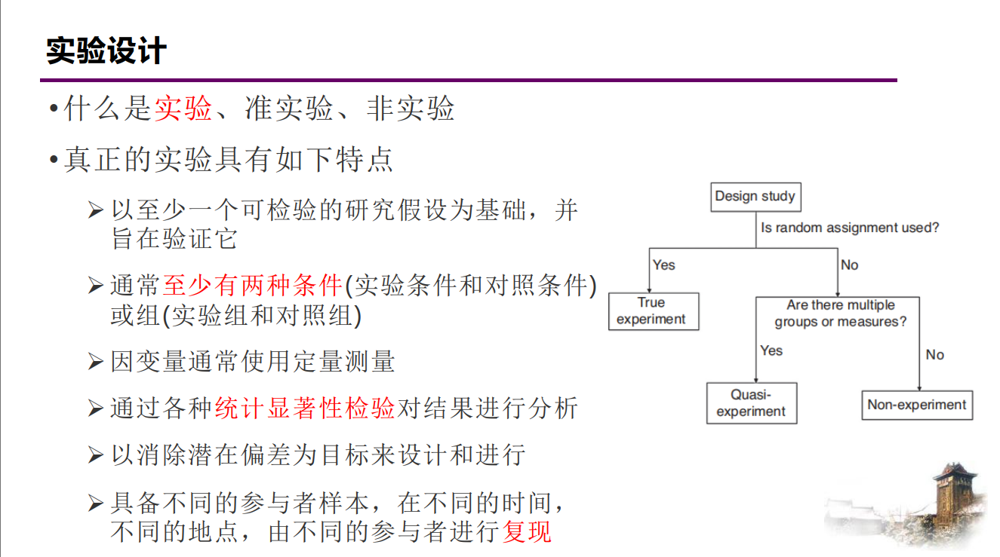

绿野仙踪法：由研究人员来扮演系统进行实验，以此实现测试现实世界中不存在的理想应用程序

组间设计和组内设计

- 组间设计：每个参与者只暴露在一种实验条件下，参与组的数量直接对应于实验条件的数量

  - 优点是设计更简洁、避免了学习效应
  - 缺点是结果受个体差异影响大、且需要的参与者数量大
  - 参与者应尽可能随机分配到不同的条件
  - 需要在不同条件下尽量平衡潜在的混杂因素
- 组内设计

  - 需要控制学习效果，将实验条件的顺序随机化，如果研究的不是初次交互，需要提供充足的培训，来减少学习效果影响
  - 需要解决疲劳问题
  - 使用拉丁方设计平衡学习和疲劳

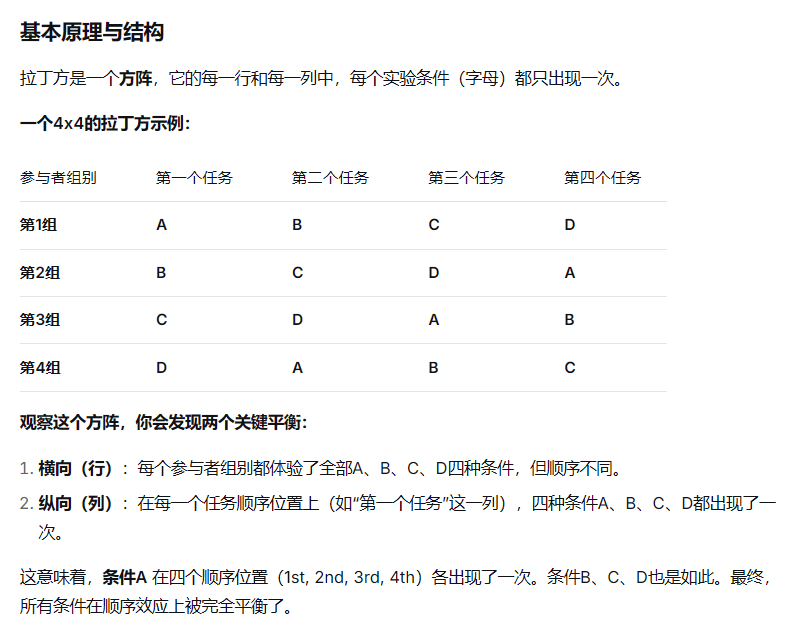

对于有多个自变量的实验，需要进行析因设计

- 允许在一个实验中研究两个或两个以上自变量之间的相互作用的影响

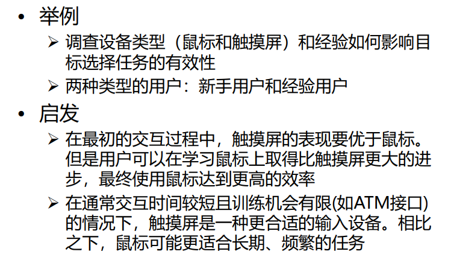

### 评估之观察用户

观察法是所有可用性方法中最简单的方法，涉及看和听两个方面
用户并不总能客观和完整地描述产品的使用情况，用户有可能忽略一些细节

观察适用于产品开发的任何阶段

- 初期：理解用户的需要
- 开发过程：检查原型
- 后期：对最终产品进行评价

观察的方法

1. 真实环境中的观察，观察者可以作为旁观者，也可以作为参与者，重点是应用的上下文
2. 受控环境中的观察，观察者不能作为参与者，重点是研究用户执行任务的细节
3. 二者差别不大，有时前者模仿后者的测试条件
4. 实地观察也可以作为实验室观察的补充

观察中的问题：不知道用户在想什么

- 解决方法：让用户“边做边说”

  - 优点是简单、只需要很少的专业技术
  - 缺点是不自然、可能改变人们执行任务的方式

合作评估：两位用户共同合作，以便他们互相讨论、相互帮助

现场观察：指在用户的实际环境中观察用户在使用软件时的情况

注意事项

1. 观察人员自始至终应尽量保持安静，保证用户操作和平时工作的状态一样，避免霍桑效应
2. 当用户的操作令观察人员无法理解时，需要打断用户，请他进行解释，或将其记录下来
3. 观察初期，应该拒绝用户的任何帮助请求，待评估完成后为用户提供适当帮助

数据记录

1. 纸笔记录 F
2. 音视频记录
3. 日志和交互记录

数据分析

1. 定性分析
2. 定量分析

### 评估之询问用户和专家

询问用户：适用于客观上较难度量的、与用户主观满意度和可能的忧虑心情相关的问题

询问专家：不知道该怎么做或者对预期的结果没有把握

访谈中的焦点小组：集体访谈的一种形式，由大约 6 到 9 个典型用户组成。焦点小组存在风险（比如从众等现象）

问卷调查与访谈：都属于间接方法

- 两者都不对用户界面本身进行研究，而只是研究用户对界面的看法
- 都不能完全听信和采纳用户的说法

询问专家之认知走查：逐步检查使用系统执行任务的过程中，可能存在的可用性问题；无需用户参与（类似启发性评估）

- 试图想象出用户在第一次使用某个产品时的想法和所采取的动作

询问专家之启发式评估：十条启发式准则 **用于早期设计**

1. 预防错误
2. 帮助用户识别、诊断、修复错误
3. 系统的可视性
4. 与现实世界相符合
5. 系统的一致性和标准化
6. 审美感和最小化设计
7. 依赖识别而非记忆
8. 用户的自主权和控制权
9. 使用的灵活性及有效性
10. 帮助文档

给出问题的严重性分类

1. 不同作用因素

    1. 频率：有多经常
    2. 影响：有多难克服
    3. 持续时间：要多长时间克服
2. 严重性等级

    1. 表面问题：不需要被修复
    2. 次要问题：需要修复，但优先级较低
    3. 主要问题：需要修复且优先级很高
    4. 灾难性问题：必须被修复

启发式评估后给出这样的一张问题表格

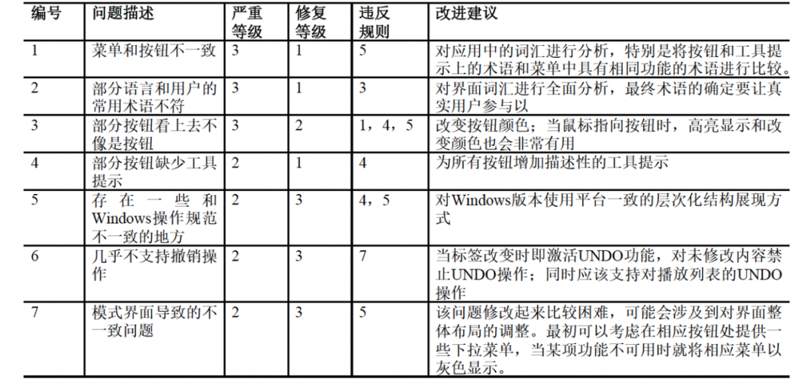

### 评估之用户测试

DECIDE 评估框架：六个步骤

1. determine 决定评估需要完成的总体目标：为什么要评估
2. explore 发掘需要回答的具体问题：根据目标确定问题
3. choose 选择用于回答具体问题的评估范型和技术：范型决定了技术类型，必须权衡实际问题和道德问题，可结合多种技术
4. identify 标识必须解决的实际问题：如选择哪些用户，任务时间多长，使用什么设施
5. decide 决定如何处理有关道德的问题：保护个人隐私
6. evaluation 评估解释并表示数据：搜集什么类型的数据，如何分析，如何表示

测试设计

1. 定义目标和问题

    1. 目标描述了开展一个测试的原因，定义了测试在整个项目中的价值
    2. 目标是对关注点的说明和解答，如用户在第一次尝试时能选择正确的菜单
2. 选择参与者​

    1. 参与者的选择对于任何实验的成功至关重要
    2. 了解用户的特性有助于选择典型用户：要尽可能接近实际用户
    3. 通常也需要平衡性别比例
    4. 至少 4-5 位，5-12 位用户就足够。参与者越多发现的可用性问题越多，在 15 位用户的时候就能发现 98% 的可用性问题，但出于成本和效率的考虑，5-12 位用户比较合理
    5. 参与者安排
        关于参与者的安排

3. 设计测试任务

    1. 测试任务应当与定义的目标相关
    2. 测试任务通常是简单任务：如查找信息；有时采用较为复杂的任务
    3. 任务不能仅限于所要测试的功能，应使用户全面的使用设计的各个区域
    4. 每项任务的时间应介于 5-20 分钟
    5. 应当以某些合乎逻辑的方法安排任务：开始时，先提出简单问题有助于增强用户的自信心
4. 明确测试步骤

    1. 在测试之前，准备好测试进度表和说明，设置好各种设备
    2. 正式测试前应进行小规模测试
    3. 在必要时询问参与者遇到什么问题
    4. 若用户确实无法完成，应让他们继续下一项任务
    5. 测试过程应控制在一小时之内
    6. 必须分析所有搜集到的数据
5. 数据搜集与分析

    1. 确定如何度量观测的结果
    2. 使用的度量类型依赖于所选择的任务
    3. 定量度量和定性度量
    4. 常用的定量度量

        1. 完成任务的时间
        2. 停止使用产品一段时间后，完成任务的时间
        3. 执行每项任务时的出错次数和出错类型
        4. 单位时间内的出错次数
        5. 求助在线帮助的次数
        6. 用户犯某个特定错误的次数
        7. 成功完成任务的用户数

## 交互式系统的需求

需求获取是项目设计的第一个阶段

不同的人群体验水平存在差异

- 程序员只创造适合专家的界面
- 市场人员要求只适合新手的交互
- 数目最多、最稳定和最重要的用户群是中间用户，往往被忽略

新手用户

- 特点：敏感且很容易在开始有挫败感
- 设计要求：不能将新手状态视为目标，让学习过程快速且富有针对性，不要使用在线帮助作为学习指导，菜单项应该是解释性的

专家用户

- 特点：对缺少经验的用户有着异乎寻常的影响，欣赏更新的且更强大的功能，不会收到复杂性增加的干扰
- 设计要求：对经常使用的工具集，要能快速访问

中间用户

- 特点：需要工具，知道如何使用参考资料，能够区分经常使用和很少使用的功能，高级功能的存在让永久的中间用户放心
- 设计要求：工具提示是适合中间用户最好的习惯用法，在线帮助是永久中间用户的极佳工具，常用功能中的工具放在用户界面的前端和中心位置，提供一些额外的高级特性

设计目标就是

- 让新手快速和无痛地称为中间用户
- 避免为想成为专家的用户设置障碍
- 让中间用户感到愉快

用户建模：构造人物角色

- 谁将使用系统
- 这些用户属于哪些类型的人群
- 是什么因素决定他们将怎样使用系统
- 他们与软件的关系又什么特征
- 他们通常需要软件提供什么支持
- 他们对软件会有怎样的行为，对软件的行为有什么预期

什么是人物角色​

- 人物角色不是真实的人
- 是基于观察到的真实人的行为和动机，并在整个设计过程中代表真实的人
- 是在统计学调查收集到的实际用户的行为数据的基础上形成的综合原型

构建人物角色应该注意什么

- 要注意与界面设计有关的角色
- 关注使角色彼此相区别的特征
- 留心焦点角色

需求获取：观察

- 在设计最初，可能不知道问什么问题，或由谁来回答这些问题
- 先去观察人们在工作环境中完成他们的活动
- 分为直接观察和间接观察（使用视频或录音）

需求获取：场景

- 表示任务和工作结构的“非正式的叙述性描述”，如讲故事

需求定义的五个步骤

1. 创建问题和前景综述：简明地反映需要改变的情况，来服务人物角色和提供产品给人物角色
2. 头脑风暴：将头脑置于“解决问题模式”中
3. 确定人物角色的期望：界面表现模型与用户心理模型尽量匹配
4. 构建情境场景剧本：将注意力集中在设计的产品中怎样能够最好地帮助人物角色到达目标
5. 确立需求

需求验证：原型

- 评估和反馈是交互设计的核心
- 用户往往不能准确描述自己的需要，但在看到或尝试某些事物后，能立即知道自己不需要什么
- 与文档相比，能更容易看到、持有和交互
- 团队成员能够有效沟通
- 原型回答问题，并支持设计师在备选方案中进行选择

原型的分类

- 低保真原型：如草图、故事板、绿野仙踪法
- 高保真原型：与最终产品更为接近，但要注意用户会认为原型就是系统，和开发人员认为已找到一个用户满意的设计的风险

层次化任务分析（HTA）：把任务分解为若干子任务，再把子任务进一步分解为更细致的子任务，之后把他们组织成“执行次序”

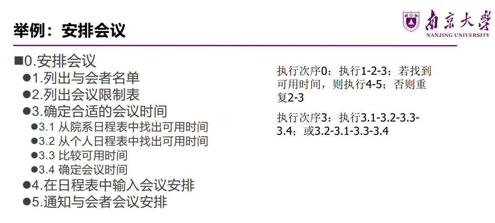

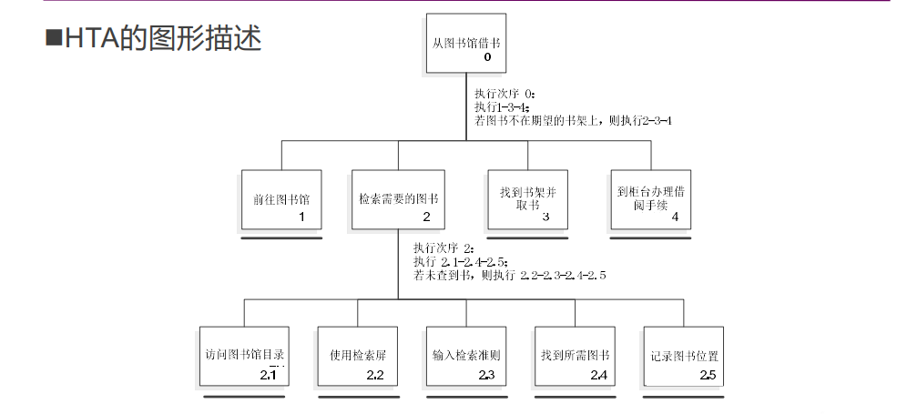

## 交互式系统的设计

简化设计的策略

1. 删除：最明显的简化设计方法 **删除不必要的**
2. 组织：最快捷的简化设计方法 **组织要提供的**
3. 隐藏：低成本的简化方案 **隐藏非核心的**
4. 转移：在设备之间转移、向用户转移

## 人机交互基础知识

人类处理机模型（大头娃娃模型）：最著名的信息处理模型
包含三个交互式组件

1. 感知处理器：信息将被输出到声音存储和视觉存储区域
2. 认知处理器：输入将被输出到工作记忆（短期记忆）
3. 动作处理器：执行动作

为什么人类处理机模型是最著名的信息处理模型

1. ​**开创性**：首个系统化、可计算的人类信息处理工程模型。
2. ​**实用性**：直接衍生出 GOMS/KLM 等强大预测工具，改变了设计实践。
3. ​**基础性**：成为后续研究和实践的通用参考框架和比较基准。
4. ​**教育普及**：作为核心知识被广泛传授，影响了一代代设计者和研究者。

大头娃娃模型存在的问题

- 把认知过程描述为一系列处理步骤
- 仅关注单个人和单个任务的执行过程，忽略了复杂操作执行中人与人之间以及任务与任务之间的互动
- 忽视了环境和其他人可能带来的影响
- 对应的改进就是外部认知模型、分布式认知模型

格式塔心理学：研究人如何感知一个良好组织的模式的，而不少将其视为一系列相互独立的部分

1. 相近性原则：空间上比较靠近的物体容易被视为整体
2. 相似性原则：例如列表的设计，将相关信息组合在一起并重复排列
3. 连续性原则：共线或具有相同方向的物体会被组合在一起，比如对齐排列
4. 对称性原则：相互对称且能够组合为有意义单元的物体会被组合在一起
5. 完整和闭合性原则：人们倾向于忽视轮廓的间隙而将其视作一个完整的整体

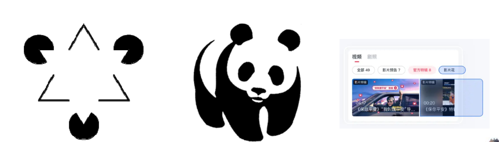

人脑中的记忆：分为三个阶段

1. 感觉记忆：又称瞬时记忆
2. 短时记忆：存储能力约为 7+-2 个信息单元，我们的界面设计的时候不能违反这个 7+-2 理论 （可用性问题中的易记性）
3. 长时记忆：信息容量几乎是无限的，长时记忆中的信息有时无法提取，不代表长时记忆区的信息丢失了

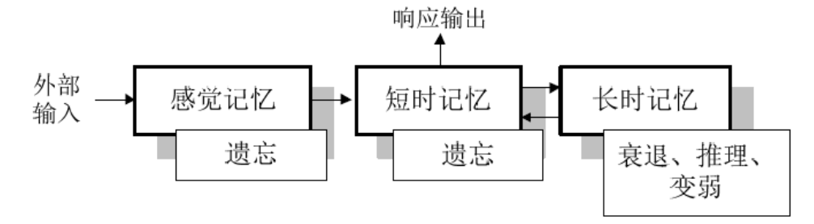

GUI 的演化：更少的记忆、更多的识别、更少的键盘和点击、更不易出错、以及更可视的上下文

多媒体界面：在单个界面中组合不同的媒体，即图形、文本、视频、声音和动画，并将他们与各种形式的交互相连接

虚拟现实（VR）和增强现实（AR）

信息可视化和仪表盘

笔式交互和触摸交互

手势界面

实物界面

可穿戴计算

脑机界面

## 交互设计模型

预测模型：能够预测用户的执行情况，但不需要对用户做实际测试
特别适合于无法进行用户测试的情形

不同的模型关注用户执行的不同方面

GOMS 模型：基于人类处理机模型，是最著名的预测模型，是关于人类如何执行认知——动作型任务，以及如何与系统交互的理论模型

- 采用“分而治之”的思想，将一个任务进行多层次的细化
- 把每个操作的时间相加就可以得到一项任务的时间

GOMS 模型的全称

- Goal：用户要达到什么**目标**
- Operator：任务执行的底层行为，不能分解，如点击鼠标
- Method：如何完成目标的过程，即对应目标的子目标序列和所需操作，如移动鼠标，输入关键字，点击 Go 按钮
- Selection：选择规则，确定当有多种方法时的选择和方法，GOMS 认为方法的选择不是随机的

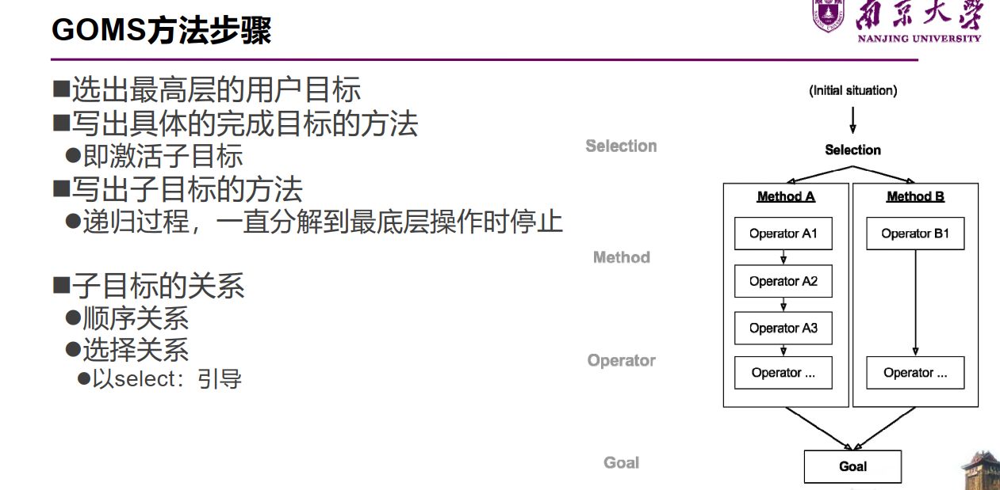

GOMS 模型分析

- 优点：能够容易地对不同的界面或系统进行比较分析
- 局限性：假设用户完全按一种正确的方式进行人机交互，没有清楚地描述错误处理的过程；任务之间的关系描述过于简单；忽略了用户间的个体差异

击键层次模型（KLM）：对用户执行情况进行**量化**预测

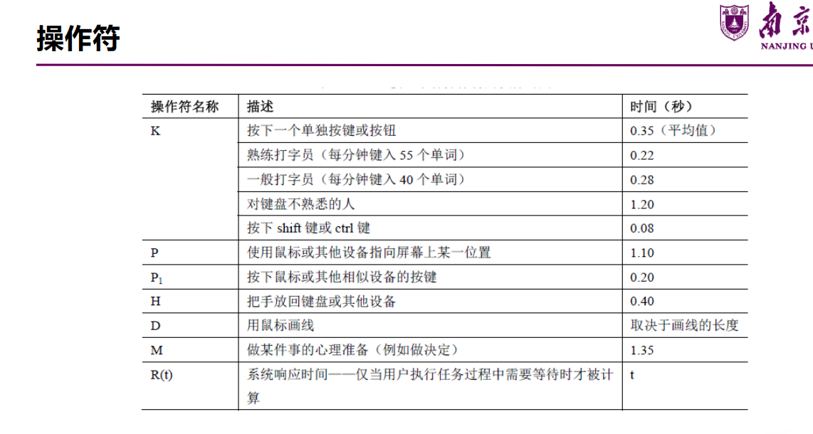

KLM 如何使用：列出操作次序，累加每一项操作的预期时间

如何确定是否需要在具体操作之前引入一个思维过程，即放置 M 操作符呢

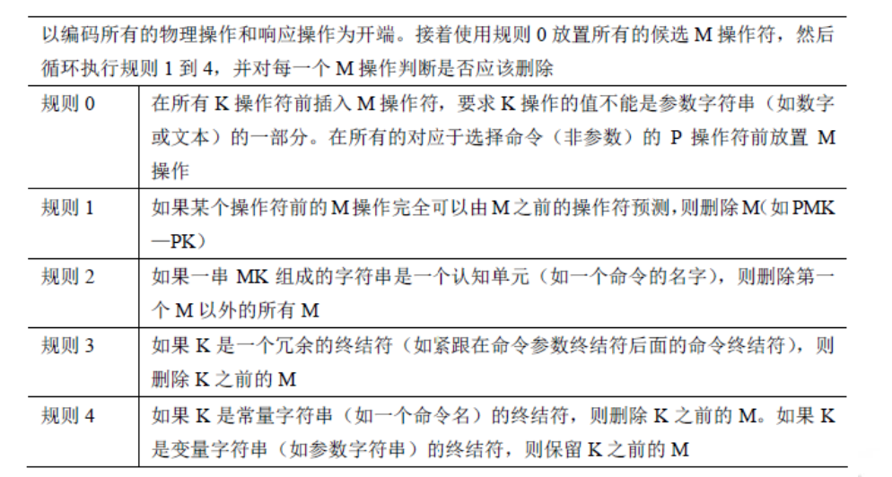

1. 在每一步需要访问长时记忆区的操作前放置一个 M
2. 在所有 K 和 P 之前放置 M
3. 删除键入单词或字符串之间的 M，因为一个单词都是一次性完整输入的
4. 删除复合操作之间的 M，如选中 P 和点击 P1

KLM 模型的优缺点

- 建模可以给出执行标准任务的时间
- 但没有考虑到错误、学习性、功能性、回忆、专注程度、疲劳、可接受性

Fitts 定律：研究哪些特性会影响用户访问屏幕组件的时间

- 能够预测使用某种定位设备指向某个目标的时间
- “最健壮并被广泛采用的人类运动模型之一”

$$
ID = log_2(2A/W)
$$

Fitts 定律描述了人类运动系统的信息量，类似信息论中的香农定律

- A 为运动距离或振幅
- N 为目标的宽度

困难指数 ID：对任务困难程度的量化，与宽度和距离有关

运动时间 $MT = a + b * ID$：在 ID 基础上将完成任务的时间量化

性能指数 $IP = ID / MT$：也被称为吞吐量

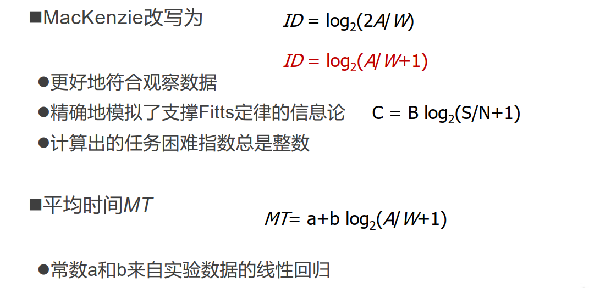

对于一般性计算，可使用 a=50，b=150（单位 ms）

Fitts 定律给出的建议

- 大目标、小距离具有优势：对选择任务而言，其移动时间随到目标距离的增加而增加，随目标大小减小而增加
- 屏幕元素应该尽可能多的占据屏幕空间（大目标）
- 最好的像素就是光标所处的像素（小距离）
- 屏幕元素应尽可能利用屏幕边缘的优势（大目标）
- 大菜单，如饼型菜单，比其他类型的菜单使用简单（大目标）

Hick’s Law：一个人拥有的选择越多，做决定的时间就越长

$$
RT = a + b log_2(n + 1)
$$

n 是选择的数量，a，b 是常数代表个体的处理速度

- 为用户提供更少、更集中的选项，帮助他们快速做出决定而不要让他们陷入思维堵塞

## 以用户为中心

UCD 项目包含的方法

- 用户参与：用户成为设计团队的一部分
- 焦点小组：允许设计者与不同的用户进行交流和观察他们如何相互联系
- 问卷调查
- 民族志观察
- 走查：专注于设计的某一具体的方面或者是整个设计
- 专家评估：基于理论知识指导
- 可用性测试

用户参与：让用户成为设计团队的一部分

- 选择哪些用户：将来真正使用系统的人，而非经理或工会代表
- 为什么让用户参与：期望管理，拥有权（人们总渴望自己的意见得到重视，更容易接受有“拥有权”的最终产品）

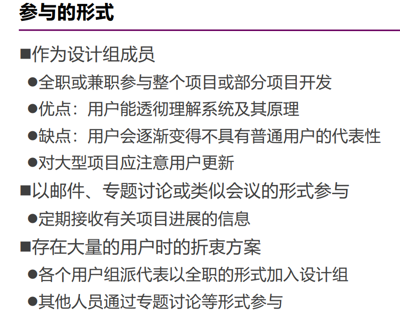

上下文询问法（情景调查）：观察并与用户交流会比仅仅观察的效果更好

- 基于“学徒模型”，用户是师傅，研究人员是学徒
- 与观察法的区别，上下文询问是边做边聊，而观察法是只看不说

UDC 的缺陷

- 影响产品的创新性
- 可操作性受到时间、预算和任务规模的限制
- 忽视了人的主观能动性和对技术的适应能力
- “这个世界上的大多数东西都是在没有得益于用户研究和以人为中心的设计方法的情况下被设计出来的”

以活动为中心的设计思想（ACD）：把用户要做的“事”作为重点关注，更适合于复杂的设计项目

ACD 是对 UCD 的一种反思

- 早期的设计是以技术为中心
- 直到出现以人为中心，这是一次飞跃
- ACD 把人与技术综合起来进行考虑，不单纯考虑人或技术，而是关注事情本身的活动目标
- ACD 同样需要对用户进行研究或调研
- 倾听用户永远是明智的，但屈从于用户的要求是不明智的

‍

## 查缺补漏

1. 举例说明平铺窗口、重叠窗口、层叠窗口的应用场合

‍

‍

‍


2. 在采用观察法进行用户调研的时候，什么时候可以停止观察

停止观察的最佳时机是当  **“新增观察带来的新见解、新模式或新问题变得极少或没有”**  时，即达到了  **“信息饱和”**

或者是当项目资源耗尽时，不得不停止观察

3. 需求分析之后，你制作了一些纸质原型，计划对他们的可用性进行评估，你将使用哪些评估方法，为什么

- 使用快速评估和启发式评估
- 在项目早期可以使用启发式评估，同时还可以结合快速评估来获取到用户的相关反馈信息

4. 评估技术的整理

||时间|参与人员|地点|数据|特征|缺点|
| :---------| -------: | :------------------: | ----------| --------------------------------------------------------| ----------------------------------------| --------------------|
|快速评估|任何阶段|||非正式记录|快速，通常在早期，需要更快速、便宜的技术||
|可用性测试||用户||出错次数、时间|评估人员检测||
|实地研究|||工作环境||在自然工作环境中||
|预测性评估||专家|||专家评估，不需要用户参加，成本低||
|用户测试||用户|实验室环境|客观的定性或定量数据|||
|观察||用户||直接观察（纸笔、音视频）或间接观察（系统日志、交互记录）|最简单的可用性方法|可能不真实、忽略细节|
|访谈||用户|||间接方法，非正式，有目的||
|问卷调查||用户|||间接方法||
|认知走查||专家||可用性问题，关注易学性|想象人们第一次使用产品||
|协作走查||用户、专家、开发人员|||||
|启发式评估|项目初期|可用性专家||可用性问题|||

5. 为什么开展小规模试验是重要的，有什么作用和实际意义

- 确认实验设计的可行性和优化实验设计
